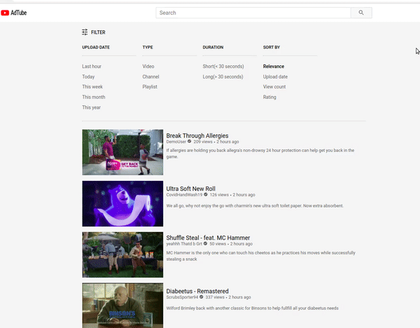

# **Adtube**

View all the ads you want here: [AdTube live!](https://adtube1.herokuapp.com/#/)

AdTube is a YouTube clone and video-sharing platform where users can browse for videos or create an account and upload and edit or delete their own
videos and comments. Users can also like videos and comments as well as search for videos and implement their own custom filter to refine their search.

## **Technologies Used:**

* Ruby On Rails
* React/Redux
* PostgresSQL database
* jQuery
* Vanilla JavaScript
* Amazon Web Services (S3)
* Heroku

## **Features:**

### Create an account or login as a demo user
### Browse and stream videos.
### Upload your own videos along with a profile picture


### Search for videos


### Enhance your search with your own custom filter



One of the ways I implemented this feature was to take advantage of an asynchronous for loop
in JavaScript by making an external API request on each iteration to get the duration of each video, given just the URL of
where the video is being hosted on Amazon S3's Active Storage, and waiting for each promise object to resolve before adding a key with the 
value I get back in the response to each video already in the components' state. Once I have the information I need to filter the videos
appropriately I pass an array with the information of what the user entered in their filter along with all the corresponding videos the user
searched for with each video duration added, into my filterSearch method where that information goes through a rigorous series of case statements
before finally being filtered and returning the correct data to the user.

```javascript
if (!this.state.alreadyFiltered) {
            if (key === "DURATION") {
              ;(async () => {
                let addVideoDurations = this.state.videos;
 
                for (let i = 0; i < addVideoDurations.length; i++) {
                  const blob = addVideoDurations[i].clipUrl;
                  const response = await getBlobDuration(blob);
                  addVideoDurations[i].duration = response;
                }
                this.filterSearch(filtered, addVideoDurations);
              })();
            } else {
                this.filterSearch(filtered, this.state.videos)
            }
        } else {
            if (key === "DURATION") {
                this.props.requestQueriedVideos(this.props.location.search)
                    .then(results => {
                        ;(async () => {
                          let addVideoDurations = Object.values(results.videos);

                          for (let i = 0; i < addVideoDurations.length; i++) {
                            const blob = addVideoDurations[i].clipUrl;
                            const response = await getBlobDuration(blob);
                            addVideoDurations[i].duration = response;
                          }
                          this.filterSearch(filtered, addVideoDurations);
                        })();
                    })
            } else {
                this.props.requestQueriedVideos(this.props.location.search)
                    .then(results => {
                        this.filterSearch(filtered, Object.values(results.videos))
                    })
            }
        }
```
### Interact with other users through comments by posting your own comment or responding to someone else's


In order to implement nested comments, so users could reply to other users comments I utilized recursive techniques
to account for infinite levels of comments and replies and normalized my data on the backend to mirror the frontend
and make it easier to render the component.

Here I recursively render a partial template on the backend by checking if the comment has any replies.

```ruby
json.extract! comment, :id, :author_id, :video_id, :body, :edited

json.created_at time_ago_in_words(comment.created_at)
json.updated_at time_ago_in_words(comment.updated_at)

json.likes do
    json.like comment.number_liked(comment.id)
    json.dislike comment.number_disliked(comment.id)
end

if !comment.parent_comment_id.nil?
    json.extract! comment, :parent_comment_id
end

if !comment.replies.empty? 
    json.replies comment.replies, partial: 'api/comments/comment', as: :comment
end

json.author do
    json.partial! "api/users/user", user: comment.author
end
```
On the front end I recursively map over the component before rendering. The component initially renders all of the top level
comments or "parent comments" and subsequently renders the replies depending on whether the user has clicked the view replies 
button.

```javascript
mapNestedComments(comments) {
        const { editComment, deleteComment, createComment, deleteCommentLike, createCommentLike, currentUser, requestUser, likes, requestComments } = this.props
        const { videoId } = this.props.match.params

        let commentsAndReplies = comments.map(comment => {
            return (
                <div className="comment-index-grid-container" key={comment.id}>
                    <div className="comment-replies-index-grid-item" id={comment.id}>
                        <CommentIndexItem
                            comment={comment}
                            editComment={editComment}
                            createComment={createComment}
                            deleteComment={deleteComment}
                            createCommentLike={createCommentLike}
                            deleteCommentLike={deleteCommentLike}
                            requestComments={requestComments}
                            videoId={videoId}
                            currentUser={currentUser}
                            requestUser={requestUser}
                            like={likes && likes[comment.id] ? likes[comment.id] : null}
                            liked={likes && likes[comment.id] ? likes[comment.id].liked : false}
                            disliked={likes && likes[comment.id] ? likes[comment.id].disliked : false}
                            />
                    {comment.replies ?
                        <div className="replies-dropdown">
                            <button onClick={this.handleReplies} value={comment.id}>
                                <span className="replies-dropdown-caret">{this.state.parentIds.includes(comment.id) ? <FaCaretUp /> : <FaCaretDown />}</span> 
                                {comment.replies.length === 1 ? <span>{this.state.parentIds.includes(comment.id) ? "Hide" : "View"} reply</span> : <span>{this.state.parentIds.includes(comment.id) ? "Hide" : "View"} {comment.replies.length} replies</span>}
                            </button>
                        </div> : null}
                    </div>
                    {comment.replies && this.state.parentIds.includes(comment.replies[0].parentCommentId) ?
                    <div className="replies-index-grid-container">
                        {this.mapNestedComments(comment.replies)}
                    </div> : null}
                </div>
            )
        })
        return commentsAndReplies
    }
```
### Like your favorite videos

## **Possible Future Directions for the Site**

* optimize overall website performance
* add video search dropdown with recent searches
* allow users to create channels that other users can subscribe to
* allow users to create posts on their channel that other users can comment on and like
* add playlists and video queue
* allow users to share videos
